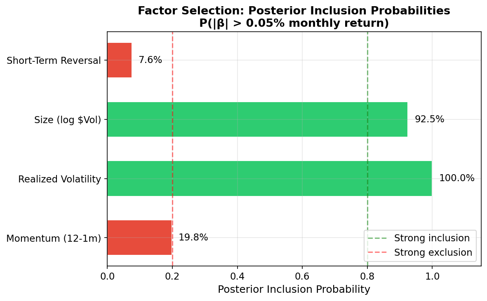
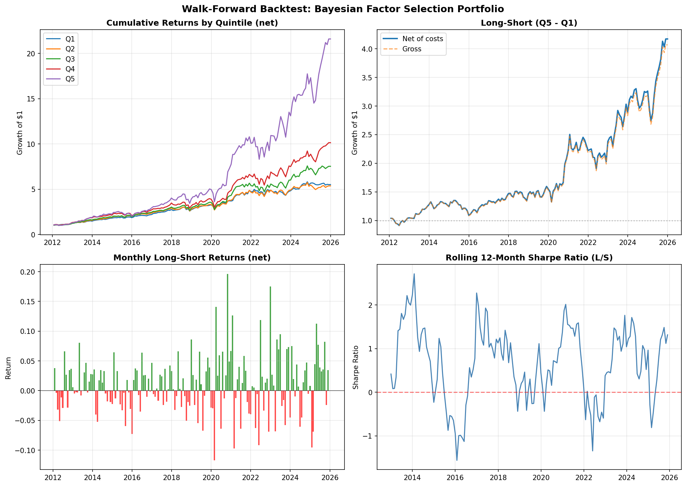

# Bayesian Factor Selection for Systematic Equity Alpha

A rigorous, end-to-end research framework for equity factor discovery and selection using Bayesian shrinkage and model averaging methods. This project addresses the "factor zoo" problem — the proliferation of spurious factors due to multiple testing and data-mining — by applying principled Bayesian inference to cross-sectional asset pricing.

📄 **[Research Note (PDF)](docs/research_note.pdf)** — Full methodology, results, and discussion

## Motivation

The academic finance literature has documented hundreds of factors that purportedly predict stock returns (Harvey, Liu & Zhu, 2016). Many of these factors are likely false discoveries resulting from extensive data mining. Traditional frequentist approaches (e.g., single-factor t-tests) are poorly equipped to handle this multiplicity problem. This project applies **Bayesian shrinkage priors** (regularized Horseshoe) to perform disciplined factor selection, providing posterior inclusion probabilities rather than binary significance decisions.

## Key Findings

| Factor | Fama-MacBeth t-stat | Bayesian PIP | Included? |
|--------|:-------------------:|:------------:|:---------:|
| Momentum (12-1m) | 1.20 | 19.8% | ✗ |
| Realized Volatility | 2.61*** | 100.0% | ✓ |
| Size (log $Vol) | −3.06*** | 92.5% | ✓ |
| Short-Term Reversal | −0.21 | 7.6% | ✗ |

The Horseshoe prior identifies **Size** and **Realized Volatility** as the two factors with credible predictive power, while aggressively shrinking Momentum and Short-Term Reversal toward zero.

<p align="center">
  
</p>

## Out-of-Sample Performance (Tear Sheet)

Using the Bayesian PIP-weighted composite signal, a walk-forward, monthly-rebalanced Long-Short (Quintile 5 minus Quintile 1) portfolio was constructed. The strategy demonstrates high resilience to transaction costs and a highly desirable **positive skewness**, hedging against tail-risk blowups.

| Metric (Net of 10 bps TC) | Q5 (Long Leg) | Q1 (Short Leg) | Long-Short Spread |
| :--- | :--- | :--- | :--- |
| **Annualized Return** | 24.54% | 12.97% | **10.74%** |
| **Annualized Volatility** | 22.30% | 11.71% | **16.98%** |
| **Sharpe Ratio** | 1.11 | 1.11 | **0.69** |
| **Max Drawdown** | -28.21% | -14.23% | **-23.95%** |
| **Skewness** | +0.10 | -0.28 | **+0.51** |

<p align="center">
  
</p>

## Methodological Highlights

- **The High-Volatility "Anomaly"**: Contrary to the traditional low-volatility anomaly, our model assigned a 100% PIP and a positive coefficient to Realized Volatility. This accurately captures the market regime of the 2010–2025 S&P 500, where high-volatility effectively served as a proxy for the mega-cap tech (High Beta) rally.
- **Taming the "Funnel of Hell"**: The hierarchical nature of the Horseshoe prior introduces severe geometric distortions during MCMC sampling. We actively monitored and addressed NUTS sampler divergences, laying the groundwork for non-centered parameterizations to stabilize the posterior geometry.

## Research Pipeline

```
Raw Market Data → Data Cleaning → Factor Construction → Fama-MacBeth Baseline
                                                              ↓
                              Bayesian Factor Selection ← Cross-Sectional Returns
                                       ↓
                          Walk-Forward OOS Validation → Performance w/ Transaction Costs
```

## Project Structure

```
bayesian-factor-selection/
├── src/
│   ├── data/               # Data ingestion, cleaning, universe construction
│   │   ├── universe.py     # S&P 500 constituent scraper
│   │   ├── fetch_prices.py # Tiingo API price downloader (resumable)
│   │   ├── french_factors.py # Ken French benchmark factors
│   │   └── prepare_panel.py  # Data cleaning & return computation
│   ├── factors/
│   │   └── compute_factors.py # Factor definitions (MOM, VOL, SIZE, STR)
│   ├── models/
│   │   ├── fama_macbeth.py      # Frequentist baseline (Newey-West SEs)
│   │   ├── bayesian_selection.py # Horseshoe prior factor selection (PyMC)
│   │   └── plot_results.py      # Publication-quality result figures
│   ├── backtest/
│   │   └── walk_forward.py  # Walk-forward OOS backtest with TC modeling
│   └── utils/
│       └── config.py        # Configuration, logging, API key management
├── configs/
│   └── config.yaml          # All hyperparameters in one place
├── docs/
│   ├── research_note.pdf    # 2-page research note
│   └── figures/             # Result figures
├── data/                    # Git-ignored (too large)
├── notebooks/               # Exploratory analysis
├── tests/                   # Unit tests
├── requirements.txt
└── README.md
```

## Data & Known Limitations

- **Price data**: Tiingo API (adjusted OHLCV, 2010–2025, 495 tickers)
- **Universe**: Current S&P 500 constituents only
- **⚠️ Survivorship bias**: The backtest universe is restricted to stocks that are *currently* in the S&P 500. Delisted or removed stocks are excluded. Results should be interpreted with this caveat.
- **Factor benchmark**: Ken French Data Library (Fama-French 5 factors + Momentum)

## Setup

```bash
# Clone
git clone https://github.com/zeyudsai/bayesian-factor-selection.git
cd bayesian-factor-selection

# Install dependencies
pip install -r requirements.txt

# Set Tiingo API key
echo "TIINGO_API_KEY=your_key_here" > .env
```

## Usage

Run the full pipeline step by step:

```bash
# Stage 1: Data
python -m src.data.universe          # Fetch S&P 500 constituents
python -m src.data.french_factors    # Download Ken French benchmark factors
python -m src.data.fetch_prices      # Download 15 years of daily prices (resumable)
python -m src.data.prepare_panel     # Clean data, compute returns

# Stage 2: Factor Construction & Baseline
python -m src.factors.compute_factors  # Compute MOM, VOL, SIZE, STR factors
python -m src.models.fama_macbeth      # Fama-MacBeth regression (sanity check)

# Stage 3: Bayesian Factor Selection
python -m src.models.bayesian_selection  # Horseshoe prior MCMC (~3 min)
python -m src.models.plot_results        # Generate result figures

# Stage 4: Out-of-Sample Backtest
python -m src.backtest.walk_forward    # Walk-forward backtest with transaction costs
```

## Tech Stack

- **Python 3.11+**
- **Polars** — High-performance panel data operations
- **Pandas / NumPy / SciPy** — Statistical modeling
- **PyMC** — Bayesian inference via MCMC (NUTS sampler)
- **ArviZ** — Posterior diagnostics and visualization
- **Matplotlib** — Publication-quality figures

## References

- Carvalho, C. M., Polson, N. G., & Scott, J. G. (2010). *The Horseshoe Estimator for Sparse Signals.* Biometrika.
- Fama, E. F., & MacBeth, J. D. (1973). *Risk, Return, and Equilibrium: Empirical Tests.* Journal of Political Economy.
- Harvey, C. R., Liu, Y., & Zhu, H. (2016). *...and the Cross-Section of Expected Returns.* Review of Financial Studies.
- Piironen, J., & Vehtari, A. (2017). *Sparsity information and regularization in the horseshoe and other shrinkage priors.* Electronic Journal of Statistics.

## Author

**Zeyu Ding** — Postdoctoral Researcher in Statistics  
TU Dortmund University / Lamarr Institute for Machine Learning and AI  
Research focus: Scalable Bayesian methods, computational statistics, coreset theory

---

*This is an independent research project. It is not investment advice.*
